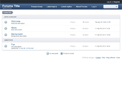

## Pure Forums skin for b2evolution CMS forum.

Link to skin: http://skins.b2evolution.net/pureforums-skin

### Update Log:

### v6.8.6-stable
- skin removed from default b2evolution install
- sync with latest b2evolution base PureForums skin
- added Gruntfile.js for SASS compilation

### v6.7.8-stable
- sync with latest b2evolution base PureForums skin

#### v6.7.7
- sync with latest b2evolution base PureForums skin
- fix for comment form on latest b2evolution CMS version

#### v6.7.3
- width switcher position fix
